# Three-Tier-Web-Application-Architecture Project
This project demonstrates the design and deployment of a scalable three-tier web application using a structured Step-by-Step Process. The solution was built using Amazon S3 for static hosting, Amazon CloudFront for content delivery, AWS Lambda for serverless compute, Amazon API Gateway for API management, and Amazon DynamoDB for the database layer.

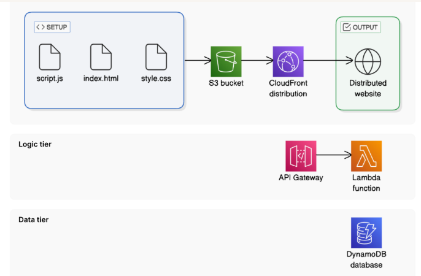

## Architecture Guide:
1. Create a Storage bucket for your website's files with S3
2. Distribute your content globally with Cloudfront
3. Build the brains of your Application using serverless functions with Lambda
4. Create an API to handle user requests with **API Gateway**
5. Store and retrieve user data with **DynamoDB**
6. Connect all these services together seamlessly for your three-tier architecture
# Step 1: Create a Storage bucket for your website's files with S3
To get started, we need a place to store our website’s files and that’s where Amazon S3 comes in.
S3 acts like a huge, scalable hard drive in the cloud, allowing you to store and access your files securely from anywhere.

* Log in to the AWS Management Console as your IAM Admin user.
* Make sure you're the AWS region closest to you.
* Head to the **S3 console.** (Search S3 on AWS)
* Click Create bucket.
* Enter a unique name for the bucket

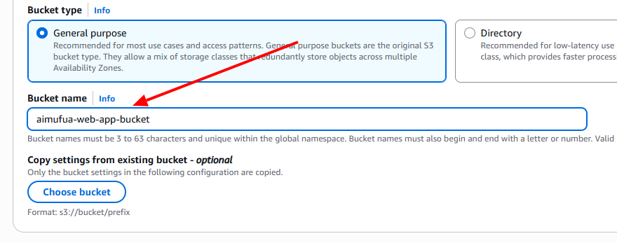

* Leave all other settings as default
* Select Create bucket.
* Click into your created bucket. 
## Upload Website files
Now that we have our storage bucket set, let's fill it up with the actual content 
of our website.
* index.html (the main file of a website)
* style.css (virtual appearance: controls everything from font sizes and colors to layout designs)
* script.js (This is a JavaScript file that adds interaction to your website)

  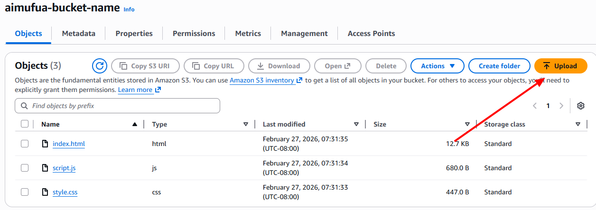
  
# Step 2: Distribute your content globally with Cloudfront
* ## Create a CloudFront Distribution
Amazon CloudFront is a Content Delivery Network (CDN) Which means it speeds up the distribution of your static and dynamic web content, such as html, css, js and image files. Amazon CloudFront distribution is a configuration that controls how CloudFront delivers your content to users. It defines the location of your website files (known as the origin), determines how content is cached, and sets other delivery options such as security settings and performance rules.
* Head to CloudFront Console

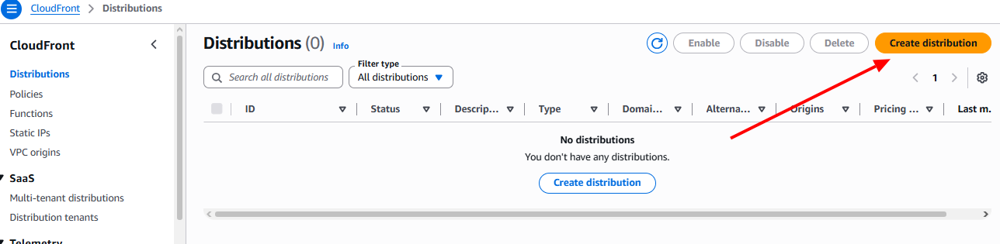  

* In the distribution Options panel, enter a name to match your S3 bucket in the Distribution name.
* Now for the Distribution type, select the Single website or app option.
* Select `Next`
* In the `Origin` panel, select the Browse S3 button
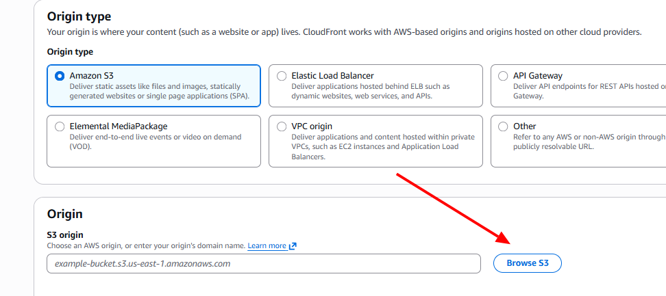 

* Select your bucket name and click Choose
* Keep the default in the Settings panel and select Next at the bottom.
* For Web Application firewall (WAF), select `Do not enable security protections`
* Let's review the configuration. Select `Create distribution` if everything looks good.

  Congratulation! You've just set up a CloudFront distribution.

## Update your S3 bucket's settings 
* In your CloudFront distribution's settings page, select Copy policy.
* Next, select the shortcut under the popup message. It lets go straight to your S3 bucket's Permissions tab
* Select `Edit`
* Past the Policy that you copied into the policy editor.
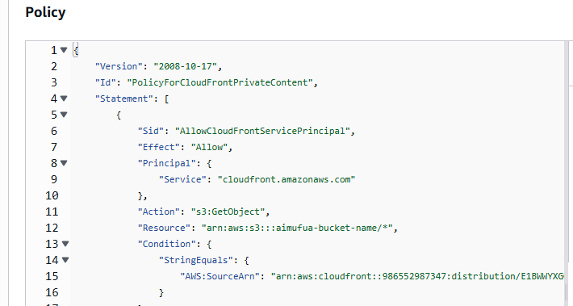 

ClICK `Save Changes`

### Verify Your CloudFront Distribution
Now, let's check if our website is live! Head back into your CloudFront console.
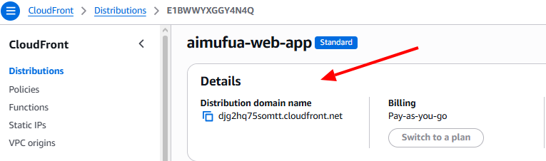 

* Copy the distribution domain name. This is the URL that CloudFront will use to serve your website.
* Past the domain name into your web browser.
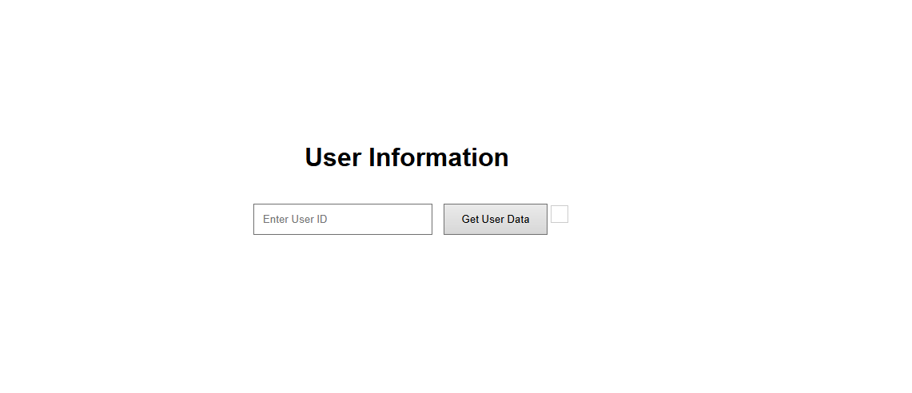
  
Our website distribution over cloudfront was successful!


# Step 3: Build the brains of your Application using serverless functions with Lambda
In this project, our backend logic will be a simple Lambda function that fetches user data from a DynamoDB table.
To make this functionality accessible externally, we’ll use API Gateway to receive incoming requests and route them to the appropriate Lambda function for processing
* Create a Lambda function to fetch data from a DynamoDB table
* Write the code for your Lambda function.
* Create an API Gateway REST API.
* Create a resource and method to handle GET requests.
* Deploy the API to make it accessible.
###  Create a Lambda function to fetch data from a DynamoDB table
AWS Lambda is a service that lets you run your code without creating or managing a server.
* Search Lambda on AWS Management console.
* Click Create Function.
* For Function  name, enter `RetrieveUserDataAimufua`
* For Runtime, select a runtime using `Node.js`
* For Architecture, select `x86_64`
* Select Create function
## Write Lambda Function Code
* Scroll down to the Code source panel
* Copy and paste the following code into the code editor, replacing Region Region with your actual AWS region (e.g, 'us-west-2)
  
```// Import individual components from the DynamoDB client package
import { DynamoDBClient } from "@aws-sdk/client-dynamodb";
import { DynamoDBDocumentClient, GetCommand } from "@aws-sdk/lib-dynamodb";

const ddbClient = new DynamoDBClient({ region: 'YOUR_REGION' });
const ddb = DynamoDBDocumentClient.from(ddbClient);

async function handler(event) {
    const userId = event.queryStringParameters.userId;
    const params = {
        TableName: 'UserData',
        Key: { userId }
    };

    try {
        const command = new GetCommand(params);
        const { Item } = await ddb.send(command);
        if (Item) {
            return {
                statusCode: 200,
                body: JSON.stringify(Item),
                headers: {'Content-Type': 'application/json'}
            };
        } else {
            return {
                statusCode: 404,
                body: JSON.stringify({ message: "No user data found" }),
                headers: {'Content-Type': 'application/json'}
            };
        }
    } catch (err) {
        console.error("Unable to retrieve data:", err);
        return {
            statusCode: 500,
            body: JSON.stringify({ message: "Failed to retrieve user data" }),
            headers: {'Content-Type': 'application/json'}
        };
    }
}

export { handler };

```

* Check: Make sure you've updated the placeholder region `YOUR REGION` to your own region code.
* Select `Deploy` This saves your code and makes the function ready to use.
* Check for the Deployment successful in he botton righ corner of the console

# Step 4: Create an API to handle user requests with API Gateway
## Set up API Gateway
Now that we have our Lambda function ready, we need a way to access it. This is where API Gateway comes in.
In this project, we're creating an API that carries requests from your user's browser to your Lambda function.
We're using a REST API today to setup an API that connects the user with your Lambda function.
* In the AWS Management Console, head to the API Gateway Console.
* Crate an New API
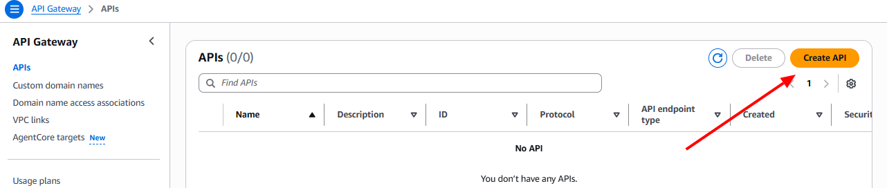

* Find REST API
* Select Build
* Under API details, select New API
* For API name, enter AimufuaUserRequestAPI
* For API endpoint type, select Regional
* Create API

Next, we'll figure out how our app can be the bridge between our users and the API. in other words, how can users send requests? That's where API resources come in!
## Set Up an API Resource
* Under Resourcess, select Create resource
* For Resource name, enter users
* Select Create resource
* Select the /users resource
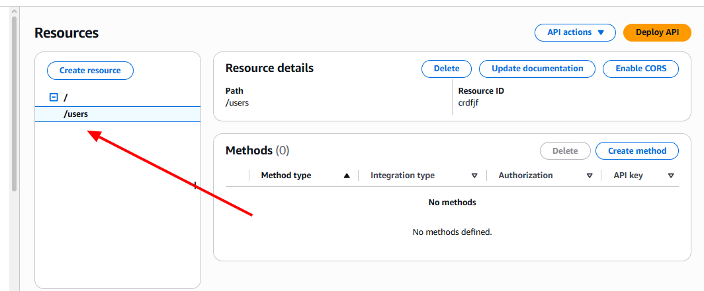

 ## Set Up an API Method 
To round off our API's setup, let's create an API method. The action (HTTP request type) that is allowed on a specific resource (URL path). or we can say an API method is the HTTP request type attached to a resource.
* In the Methods panel, select Create method
* Select GET from the Method type drop down
* Select Lambda Function for the Integration type.
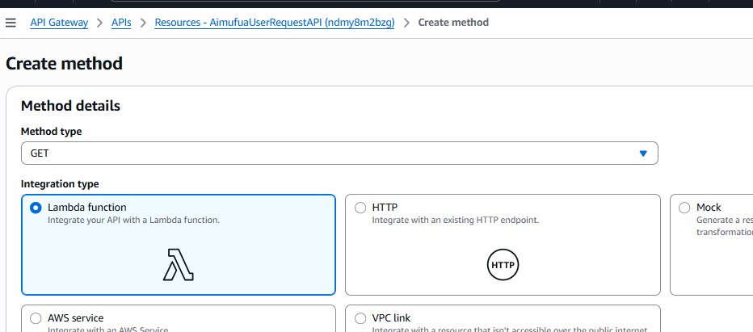

* Switch on Lambda Proxy Integretion
* For the Lambda function, make sure the default region selected is where you've created your function.
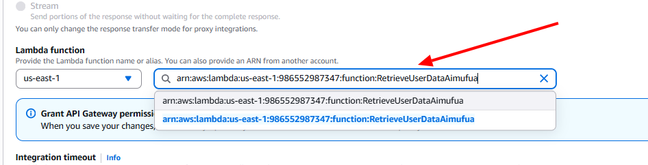

  * Select Deploy API
  * For stage Select new
(API Gateway lets you deploy different versions of your API to different stages. This way, you can easily control who accesses what version of your API and when.)
  * For stage name, enter prod
  * Select **Deploy**
    ### Visit your API
  * On the same page, find your prod stage's Invoke URL.
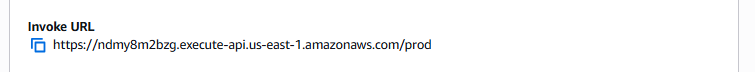

  * Copy the Invoke URL
  * Access the URL in a new tab on your browser.
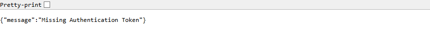

 Yes, you'll get an error because we haven't set up our DynamoDB table yet. That's okay! We're getting to that next
 
# Step 5: Store and retrieve user data with DynamoDB
The data tier is where you store all the data that your application uses. We'll use DynamoDB to store some user data.
### Create a DynamoDB table.
### Add user data into your table.
* Head to the **DynamoDB Console**
* Select Create table
* For Table name, enter UserData
* For **Partition key,** enter userId
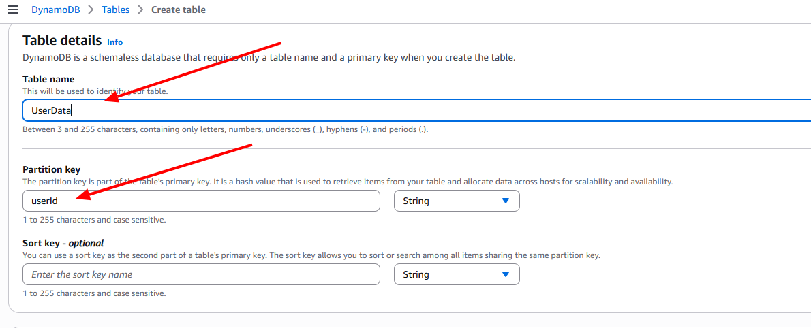
  
* Select String as the data type for the partition key.
* Leave the default settings for the rest of the options.
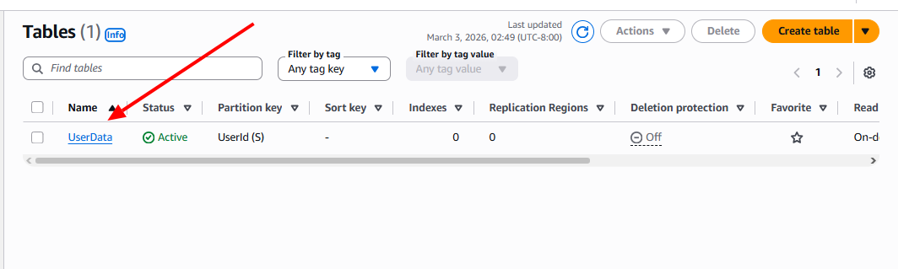

Now that we have our DynamoDB table set up, let's add some sample data so we can see our Lambda function in action later.
* We'll wait until the table status changes to Active. While we wait...
* Once the table status changes to Active, select your UserData table.
* Select Explore **table items**
* At the Items returned panel, select Create item.
* Select Switch to JSON view.

DynamoDB stores your data in JSON! By switching to JSON view, you can edit your data in a code format instead of filling out a form.
* Switch off View **DynamoDB JSON.**
* Paste the following **JSON** into the editor:

  ```{
  "userId": "1",
  "name": "Test User",
  "email": "test@example.com"
 
  * Select Create Item
  That's a piece of data in our DynamoDB table now

  ### Grant DynamoDB access to Lambda
 * Head back to your Lambda console.
 * Switch to the Configuration tab in your Lambda function
 * Select Permissions
 * Select the execution role name, it will look something like `RetrieveUserData-role-xxxxxxxx.`
 * This shortcut will take you to the IAM console, with your Lambda function readily open.
 * Select Add Permissions
 * Select Attach Policies
 * Type DynamoDB in the search bar.
 * Select AmazonDynamoDBReadOnlyAccess as the permission policy we'll use.
 * Select Add Permissions
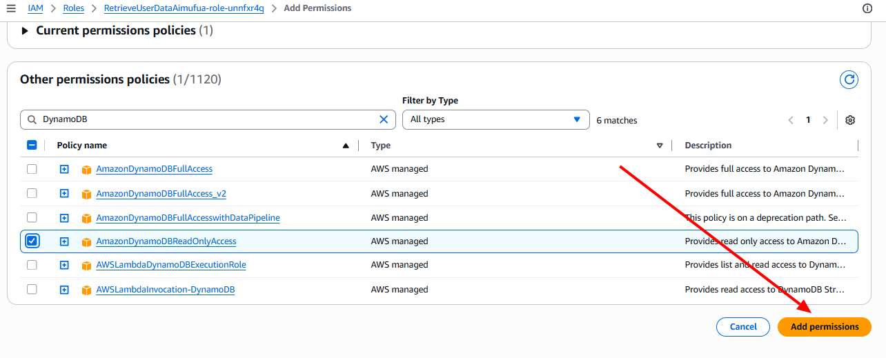

Permissions added. This means your Lambda function should be able to read DynamoDB table items.
With the data tier officially ticked off, now we're official

# Step 6: Connect all these services together seamlessly for your three-tier architecture
Now, it's time to connect them. We'll update our `index.html` file to make a request to our API Gateway endpoint and display the returned data.ly ready to merge the three layers
* Update your `script.js` file with JavaScript code to make an API request.
* Verify that the data is displayed on your website.
## Verify API Functionality
It's time for us to test our API:
* Head back into your API Gateway console.
* Copy your prod stage API's Invoke URL.
* Append `/users?userId=1` to the end of the URL you've copied.
* Run the edited URL in your web browser.
* you can see your table's data getting returned by the API.
  
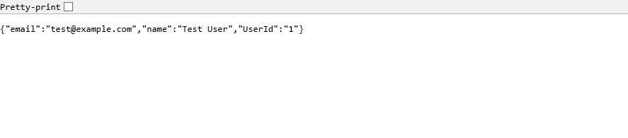

We just finished the Logic and data verification
## Verify the distributed website
* Go back to the **CloudFront console.**
* Locate your distribution and copy the Distribution Domain Name (URL).
* Open the URL in your browser.
* Try entering `1` in the userId field and selecting `Get User Data.`
* Do you see data returned to you?

BUT NOT YET....

## We need to update the connection between the presentation and logic tiers
Where do you think your website is connected to your Lambda function?
* You can troubleshoot frontend errors using your browser's developer tools.
* Open your browser's developer tools, usually by pressing `F12` on the keyboard. If you are using Opera mini `Ctrl + Shift + I`
* Select **Console tab**
Read the entire error message - notice that it actually references where you can find the URL: 
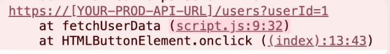

That's right, this URL is in line 9 of our `script.js` file.
* Open your local computer's Downloads folder.
* Open **script.js** in a code/text editor.
* There you will see a line that directly references [YOUR-PROD-API-URL]
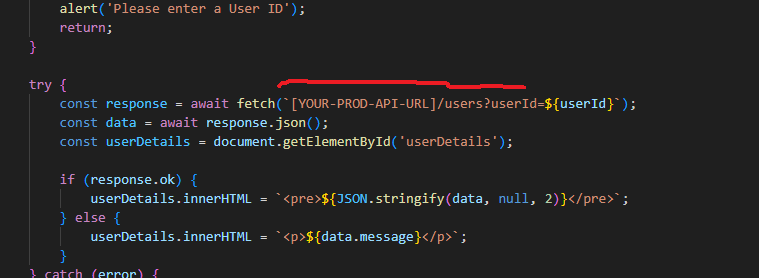

## Validate a Fully Functioning Web Application
Now it’s time to verify that your web application is working correctly. Try searching for items in the app to confirm everything functions as expected.

In this step, you will:
* Test your Amazon CloudFront website again.
* Resolve an error on the browser side
### Verify Your CloudFront Site
* Access your website through the CloudFront URL again.
* Can you see your data now?
* Also, you can use the Console developer tool to investigte your error.
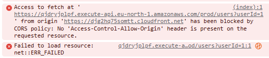

### What's the error this time?
The CORS (Cross-Origin Resource Sharing) error occurs because your Amazon API Gateway is currently configured to accept requests only from its direct invoke URL. At the moment, the API is not allowing requests coming from your Amazon CloudFront domain where your frontend application is hosted. To fix this issue, you need to enable CORS on your API Gateway so that it allows requests originating from your frontend website’s domain.

### Configure CORS on API Gateway
* Head back to the Amazon API Gateway console in your AWS account.
* Navigate to the Resources tab.
* Select the /users resource.
* Select Enable **CORS.**
* In the CORS configuration, check both GET and OPTIONS under Access-Control-Allow-Methods.
* Enter your CloudFront distribution domain name as the **Access-Control-Allow-Origin** value. This will allow requests from your CloudFront domain to your API.
### Deploy Your API
After enabling **CORS,** you must redeploy your API for the changes to take effect:
* Select Deploy API.
* Choose your deployment stage i.e. prod.
* Click **Deploy** to update the stage.
  
### Add CORS Headers in Your Lambda Function
* Update your Lambda function code to include the `Access-Control-Allow-Origin` header in the response
Check: Have you updated `YOUR_REGION` to your region's code?

``` // Import individual components from the DynamoDB client package
import { DynamoDBClient } from "@aws-sdk/client-dynamodb";
import { DynamoDBDocumentClient, GetCommand } from "@aws-sdk/lib-dynamodb";

const ddbClient = new DynamoDBClient({ region: 'YOUR_REGION' });
const ddb = DynamoDBDocumentClient.from(ddbClient);

async function handler(event) {
    const userId = event.queryStringParameters.userId;
    const params = {
        TableName: 'UserData',
        Key: { userId }
    };

    try {
        const command = new GetCommand(params);
        const { Item } = await ddb.send(command);

        if (Item) {
            return {
                statusCode: 200,
                headers: {
                    'Content-Type': 'application/json',
                    'Access-Control-Allow-Origin': '*' // Allow CORS for all origins, replace '*' with specific domain in production
                },
                body: JSON.stringify(Item)
            };
        } else {
            return {
                statusCode: 404,
                headers: {
                    'Content-Type': 'application/json',
                    'Access-Control-Allow-Origin': '*'
                },
                body: JSON.stringify({ message: "No user data found" })
            };
        }
    } catch (err) {
        console.error("Unable to retrieve data:", err);
        return {
            statusCode: 500,
            headers: {
                'Content-Type': 'application/json',
                'Access-Control-Allow-Origin': '*'
            },
            body: JSON.stringify({ message: "Failed to retrieve user data" })
        };
    }
}

export { handler };
 ```

* For security best practice, replace * with your CloudFront domain name. Keeping Access-Control-Allow-Origin means you're allowing everyone to use your API, but we should restrict access to just your CloudFront distribution.
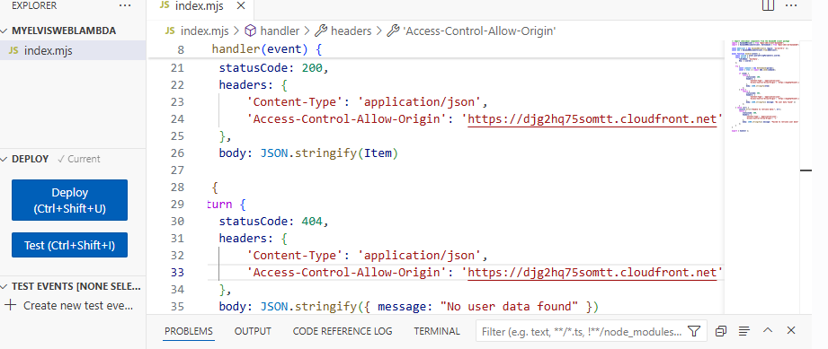
  
* Select Deploy to deploy your updated function.

Now let's do a final Test...
Let's do one more refresh of our CloudFront domain name.
You should now see the data fetched from DynamoDB displayed on your website!
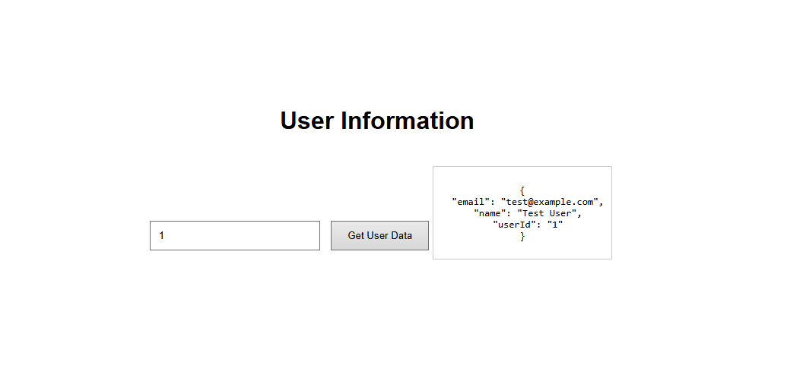

## That's it!
We just built a three-tier web app on AWS

# Troubleshooting
### S3 File Path Sensitivity
Amazon S3 is case-sensitive and path-sensitive
* Ensure your files are arranged correctly in the bucket.
* Make sure the file names in index.html match the exact names in S3.

### DynamoDB Case Sensitivity
Amazon DynamoDB is also case-sensitive.
* The partition key name must match exactly.
* If your table key is userId, using UserId or userid in your Lambda code will fail.

 ## Additional Notes
  * To prevent unnecessary charges, I removed the resources from my AWS console after completing the project. As a result, this GitHub repository now serves as the primary showcase of my work. I have carefully documented each step and included detailed explanations to provide a clear and comprehensive understanding of my approach.
 
