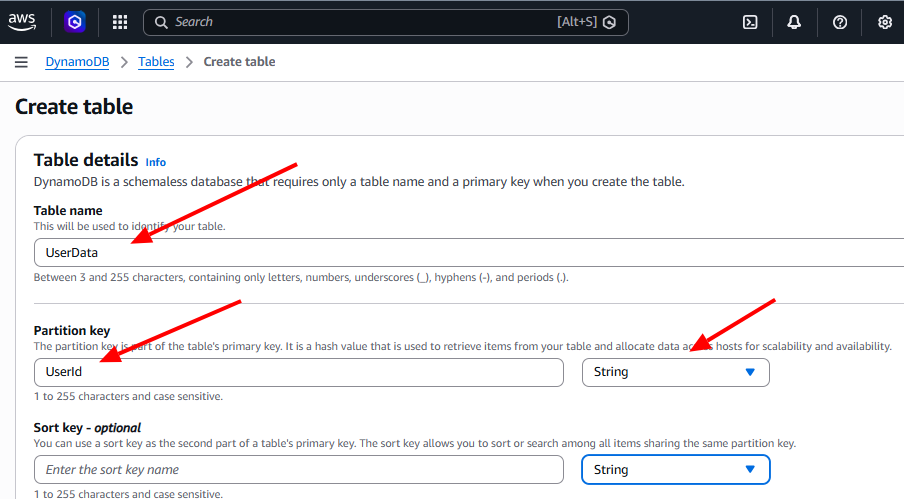

# Three-Tier-Web-Application-Architecture Project
This project demonstrates the design and deployment of a scalable three-tier web application using a structured Step-by-Step Process. The solution was built using Amazon S3 for static hosting, Amazon CloudFront for content delivery, AWS Lambda for serverless compute, Amazon API Gateway for API management, and Amazon DynamoDB for the database layer.


## Architecture Guide:
1. Create a Storage bucket for your website's files with S3
2. Distribute your content globally with Cloudfront
3. Build the brains of your Application using serverless functions with Lambda
4. Create an API to handle user requests with API Gateway
5. Store and retrieve user data with DynamoDB
6. Connect all these services together seamlessly for your three-tier architecture
# Step 1: Create a Storage bucket for your website's files with S3
To get started, we need a place to store our website’s files and that’s where Amazon S3 comes in.
S3 acts like a huge, scalable hard drive in the cloud, allowing you to store and access your files securely from anywhere.

* Log in to the AWS Management Console as your IAM Admin user.
* Make sure you're the AWS region closest to you.
* Head to the S3 console. (Search S3 on AWS)
* Click Create bucket.
* Enter a unique name for the bucket


* Leave all other settings as default
* Select Create bucket.
* Click into your created bucket. 
## Upload Website files
Now that we have our storage bucket set, let's fill it up with the actual content 
of our website.
* index.html (the main file of a website)
* style.css (virtual appearance: controls everything from font sizes and colors to layout designs)
* script.js (This is a JavaScript file that adds interaction to your website)

  
  
# Step 2: Distribute your content globally with Cloudfront
* ## Create a CloudFront Distribution
Amazon CloudFront is a Content Delivery Network (CDN) Which means it speeds up the distribution of your static and dynamic web content, such as html, css, js and image files. Amazon CloudFront distribution is a configuration that controls how CloudFront delivers your content to users. It defines the location of your website files (known as the origin), determines how content is cached, and sets other delivery options such as security settings and performance rules.
* Head to CloudFront Console

  

* In the distribution Options panel, enter a name to match your S3 bucket in the Distribution name.
* Now for the Distribution type, select the Single website or app option.
* Select `Next`
* In the `Origin` panel, select the Browse S3 button
 

* Select your bucket name and click Choose
* Keep the default in the Settings panel and select Next at the bottom.
* For Web Application firewall (WAF), select `Do not enable security protections`
* Let's review the configuration. Select `Create distribution` if everything looks good.

  Congratulation! You've just set up a CloudFront distribution.

## Update your S3 bucket's settings 
* In your CloudFront distribution's settings page, select Copy policy.
* Next, select the shortcut under the popup message. It lets go straight to your S3 bucket's Permissions tab
* Select `Edit`
* Past the Policy that you copied into the policy editor.
 

ClICK `Save Changes`

# Step 3: Build the brains of your Application using serverless functions with Lambda
In this project, our backend logic will be a simple Lambda function that fetches user data from a DynamoDB table.
To make this functionality accessible externally, we’ll use API Gateway to receive incoming requests and route them to the appropriate Lambda function for processing
* Create a Lambda function to fetch data from a DynamoDB table
* Write the code for your Lambda function.
* Create an API Gateway REST API.
* Create a resource and method to handle GET requests.
* Deploy the API to make it accessible.
###  Create a Lambda function to fetch data from a DynamoDB table
AWS Lambda is a service that lets you run your code without creating or managing a server.
* Search Lambda on AWS Management console.
* Click Create Function.
* For Function  name, enter `RetrieveUserDataAimufua`
* For Runtime, select a runtime using `Node.js`
* For Architecture, select `x86_64`
* Select Create function
## Write Lambda Function Code
* Scroll down to the Code source panel
* Copy and paste the following code into the code editor, replacing Region Region with your actual AWS region (e.g, 'us-west-2)
  
```// Import individual components from the DynamoDB client package
import { DynamoDBClient } from "@aws-sdk/client-dynamodb";
import { DynamoDBDocumentClient, GetCommand } from "@aws-sdk/lib-dynamodb";

const ddbClient = new DynamoDBClient({ region: 'YOUR_REGION' });
const ddb = DynamoDBDocumentClient.from(ddbClient);

async function handler(event) {
    const userId = event.queryStringParameters.userId;
    const params = {
        TableName: 'UserData',
        Key: { userId }
    };

    try {
        const command = new GetCommand(params);
        const { Item } = await ddb.send(command);
        if (Item) {
            return {
                statusCode: 200,
                body: JSON.stringify(Item),
                headers: {'Content-Type': 'application/json'}
            };
        } else {
            return {
                statusCode: 404,
                body: JSON.stringify({ message: "No user data found" }),
                headers: {'Content-Type': 'application/json'}
            };
        }
    } catch (err) {
        console.error("Unable to retrieve data:", err);
        return {
            statusCode: 500,
            body: JSON.stringify({ message: "Failed to retrieve user data" }),
            headers: {'Content-Type': 'application/json'}
        };
    }
}

export { handler };

```

* Check: Make sure you've updated the placeholder region `YOUR REGION` to your own region code.
* Select `Deploy` This saves your code and makes the function ready to use.
* Check for the Deployment successful in he botton righ corner of the console

# Step 4: Create an API to handle user requests with API Gateway
## Set up API Gateway
Now that we have our Lambda function ready, we need a way to access it. This is where API Gateway comes in.
In this project, we're creating an API that carries requests from your user's browser to your Lambda function.
We're using a REST API today to setup an API that connects the user with your Lambda function.
* In the AWS Management Console, head to the API Gateway Console.
* Crate an New API


* Find REST API
* Select Build
* Under API details, select New API
* For API name, enter AimufuaUserRequestAPI
* For API endpoint type, select Regional
* Create API

Next, we'll figure out how our app can be the bridge between our users and the API. in other words, how can users send requests? That's where API resources come in!
## Set Up an API Resource
* Under Resourcess, select Create resource
* For Resource name, enter users
* Select Create resource
* Select the /users resource


 ## Set Up an API Method 
To round off our API's setup, let's create an API method. The action (HTTP request type) that is allowed on a specific resource (URL path). or we can say an API method is the HTTP request type attached to a resource.
* In the Methods panel, select Create method
* Select GET from the Method type drop down
* Select Lambda Function for the Integration type.


* Switch on Lambda Proxy Integretion
* For the Lambda function, make sure the default region selected is where you've created your function.


  * Select Deploy API
  * For stage Select new
(API Gateway lets you deploy different versions of your API to different stages. This way, you can easily control who accesses what version of your API and when.)
  * For stage name, enter prod
  * Select Deploy
    ### Visit your API
  * On the same page, find your prod stage's Invoke URL.


  * Copy the Invoke URL
  * Access the URL in a new tab on your browser.


 Yes, you'll get an error because we haven't set up our DynamoDB table yet. That's okay! We're getting to that next
 
# Step 5: Store and retrieve user data with DynamoDB
The data tier is where you store all the data that your application uses. We'll use DynamoDB to store some user data.
### Create a DynamoDB table.
### Add user data into your table.
* Head to the DynamoDB Console
* Select Create table
* For Table name, enter UserData
* For Partition key, enter UserId

  
* Select String as the data type for the partition key.
* Leave the default settings for the rest of the options.


Now that we have our DynamoDB table set up, let's add some sample data so we can see our Lambda function in action later.
* We'll wait until the table status changes to Active. While we wait...
* Once the table status changes to Active, select your UserData table.
* Select Explore table items
* At the Items returned panel, select Create item.
* Select Switch to JSON view.
DynamoDB stores your data in JSON! By switching to JSON view, you can edit your data in a code format instead of filling out a form.
* Switch off View DynamoDB JSON.
* Paste the following JSON into the editor:

  ```{
  "userId": "1",
  "name": "Test User",
  "email": "test@example.com"
}
```
  
